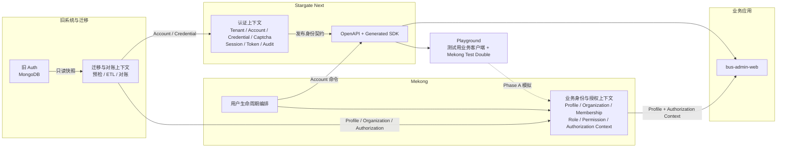

# 上下文映射

## 1. 映射目的

本文只描述 Stargate Next、Mekong、业务应用、Playground 和旧 Auth 之间的边界、上下游关系与集成方式。各领域对象和业务规则见[领域概念](./domain-concepts.md)。

基本原则：

- Stargate Next 拥有认证事实，Mekong 拥有业务身份与授权事实。
- `tenantId` 是 Stargate Next 发布的认证隔离事实，不是 Mekong 的业务授权事实。
- 双方只通过稳定的 `accountId` 关联，不共享 ORM model、数据库写路径或事务。
- OpenAPI、生成 SDK 和 slim JWT 是认证上下文的发布语言。
- Playground 只提供测试替身，不是业务事实来源。
- 旧 Auth 和迁移上下文只存在于切换阶段，不进入目标运行时。

## 2. 上下文总览

用户生命周期编排是跨上下文流程协调者，不拥有 Account、Profile 或 Authorization 数据。

## 3. 限界上下文

| 上下文 | 所有者 | 拥有 | 不拥有 |
| --- | --- | --- | --- |
| 认证上下文 | Stargate Next | Tenant、Tenant API Key、Account、登录标识、PasswordCredential、Captcha、Session、Token、认证审计 | Profile、Organization、Role、Permission |
| 业务身份与授权上下文 | Mekong | UserProfile、Organization、Membership、Role、Permission、Authorization Context | 密码、Account 状态、Auth Session |
| 业务应用上下文 | bus-admin-web | 页面和业务用例、受保护资源 | 认证或授权主数据 |
| Playground 验收上下文 | Stargate Next 项目 | 测试用业务客户端、slim session、Mekong test double | 生产或迁移数据 |
| 迁移与对账上下文 | Auth 与 Mekong 联合 | 字段映射、预检、ETL、对账结果 | 目标业务事实 |
| 旧 Auth 上下文 | 旧系统 | 旧 User、Namespace、Session 和权限 claims | 目标模型 |

认证上下文内的 Account、Authentication、Session、Token 和 Audit 是共享统一语言的内部模块，不再拆成独立限界上下文。

## 4. 上下文关系

### 4.1 认证上下文 → Mekong

关系模式：

- **Upstream / Downstream**：认证上下文是身份契约上游，Mekong 是下游。
- **Open Host Service（OHS）**：Stargate Next 通过 HTTP API 提供身份能力。
- **Published Language（PL）**：OpenAPI、生成 SDK、错误码和 JWT claims。
- **Anti-Corruption Layer（ACL）**：Mekong 的 Auth client 和 slim-session adapter 将外部 DTO/JWT 翻译为 Principal 与 Account Reference。

上游保证：

- AccountId 稳定且不复用。
- OpenAPI 是唯一契约来源。
- JWT 只包含 `sub`、`sid`、`tid`、`type`、`iat`、`exp`。
- Account、Session、Captcha、限流和认证审计均以 `tenantId` 隔离；缺少 Tenant header 的兼容调用落入 `default`。
- 登录、Refresh、Logout、Account 和 Session 管理具有稳定语义。

下游约束：

- 不从 JWT 推断 Organization、Role 或 Permission。
- 不把 `tid` 映射为 Organization、Role、Permission 或数据范围。
- 不直接读取 Auth PostgreSQL。
- 不复制密码、Session 或 Account active 状态为本地事实来源。
- 只通过生成 SDK 或受控 adapter 调用 Auth。

### 4.2 Mekong → 业务应用

关系模式：

- **Upstream / Downstream**：Mekong 是业务身份与授权上游，三个应用是下游。
- **Customer / Supplier**：应用提出授权需求，Mekong 维护统一的 Profile 和 Authorization Context。
- **Conformist**：应用消费 Mekong 发布的 Permission 和 Organization Scope，不各自复制 RoleToPermissions。

应用负责：

1. 校验 Access Token 并得到 `{ tenantId, accountId, sessionId }`；用 `tenantId` 约束认证集成边界，但不据此授予业务权限。
2. 按 `accountId` 加载当前 Authorization Context。
3. 将 Permission 和 Organization Scope 应用于自己的业务资源。
4. 区分 Token 无效、权限不足和上游服务异常，不在异常时提升权限。

### 4.3 Playground → Auth 与 Mekong

Playground 对 Auth 是严格消费 OpenAPI 和 SDK 的 **Conformist / Contract Test Consumer**。

Phase A 中，Playground 对 Mekong 是 **Test Double**：

- 模拟 Profile、Organization、Membership、Role 和 Permission 查询。
- 数据只存于进程内 memory 或隔离 Redis。
- 不调用旧 Auth 的 User、Namespace、Role、Permission API。
- 不创建 PostgreSQL schema，也不参与生产迁移。

Phase B 迁移的是验收场景和查询契约，不是 Playground mock 数据或实现。

### 4.4 旧 Auth → 迁移与对账上下文

关系模式：

- **Legacy Upstream**：旧 Auth 提供只读一致性快照。
- **Anti-Corruption Layer**：迁移上下文将旧混合模型翻译为两个目标模型。
- **Separate Ways after Cutover**：整体切换后不再运行时依赖旧 Auth。

迁移映射：

- AccountId、登录标识、状态和当前密码凭证进入认证上下文。
- Profile、Organization、Membership、Role 和 Permission 进入 Mekong。
- 旧 Session、Captcha 和未确认使用的数据不迁移。

禁止把旧 User/Namespace 聚合、Mongo schema 或业务 JWT claims 直接传播到新上下文。

## 5. 集成与一致性

### 5.1 身份契约

认证上下文发布以下能力：

- Tenant 控制面，以及单一 Tenant 内的 Tenant API Key 管理。
- Captcha 创建和验证。
- Login、Refresh、Logout。
- Account 创建、查询、更新、软删除和改密。
- Session 查询与撤销。

契约约束：

- OpenAPI 是唯一真源，SDK 由 OpenAPI 生成。
- Auth 响应不包含 Profile 或业务授权。
- API、日志和审计不暴露密码、Token、Captcha 或内部 hash。
- API Key 只代表服务调用方，不映射为人员 Principal。
- Admin API Key 是平台控制面凭证；兼容 Service API Key 固定 `default`；Tenant API Key 固定所属 Tenant。三者都不是业务授权主体。
- 数据面通过 `x-tenant-id` 选择或校验单一 Tenant；Tenant 控制面不得被 client 级 Tenant header 污染。

Access Token 只建立 Principal。`tenantId` 只说明该 Principal 来自哪个认证隔离边界；业务应用仍须按 `accountId` 从 Mekong 加载当前授权上下文。

### 5.2 跨上下文流程

登录：

`App -> Auth login -> Principal -> Mekong Authorization Context -> protected resource`

创建业务用户：

1. Mekong 编排调用 Auth 创建 Account，获得 AccountId。
2. Mekong 在本地事务中创建 Profile、Membership 和授权关系。
3. Mekong 写入失败时，调用幂等 Account 软删除进行补偿。

禁用与改密：

- 禁用由 Auth 修改 Account 状态并撤销全部 Session。
- 改密只写 Auth，并在同一 Auth 事务中撤销全部 Session。
- Mekong 不复制 active 状态或 PasswordCredential。

删除业务用户：

1. Mekong 检查业务引用。
2. 删除或软删除 Profile 与授权关系。
3. 调用 Auth 软删除 Account 并撤销全部 Session。
4. 每一步均须可安全重试。

### 5.3 一致性边界

强一致：

- Auth 单库事务维护 Account、Credential 和相关 Session 变更。
- Mekong 单库事务维护 Profile、Organization、Membership 和授权关系。

最终一致：

- 创建和删除业务用户。
- 同时修改登录联系方式与业务联系方式。
- 迁移后的 Account/Profile 数量与引用对账。

跨上下文不使用分布式事务、共享 schema、跨库外键或同一字段的长期双写。
