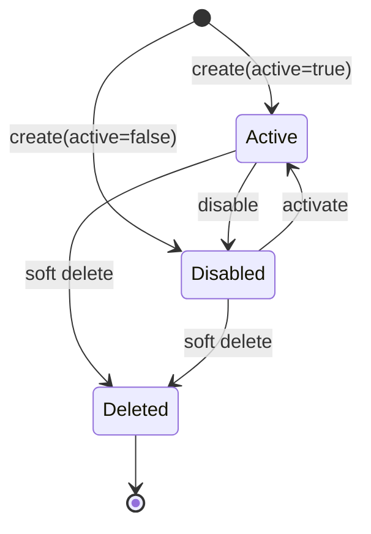
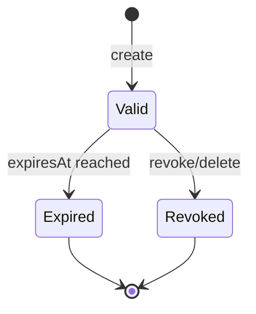
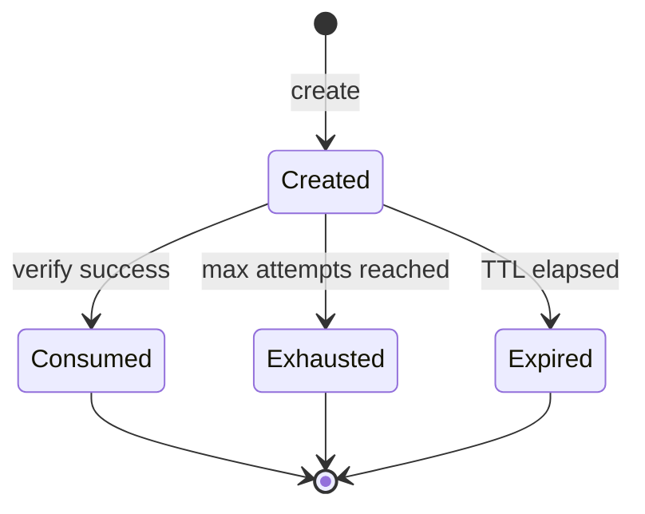

# 领域概念

## 1. 建模范围

本文定义 Stargate Next 认证域以及它与 Mekong 业务身份域协作时使用的统一语言、领域对象、聚合边界和业务规则。

建模遵循以下边界：

- Stargate Next 负责 Tenant、Tenant API Key、账户、登录标识、密码凭证、认证、Session、Access Token、Captcha 和认证审计。
- Mekong 负责 User Profile、Organization、Membership、Role、Permission 和业务授权。
- Playground 在 Phase A 模拟 Mekong 概念，但不因此获得这些数据的所有权。
- 两个领域只通过 `accountId` 关联，不共享聚合、数据库模型或事务。

本文描述的是领域语义，不等同于数据库表、API DTO 或页面模型。同一个领域对象可以被持久化为一张表、多个 Redis key，或只在一次请求中计算产生。

## 2. 统一语言

### 2.1 身份与认证

| 术语 | 定义 | 不表示 |
| --- | --- | --- |
| Tenant（租户） | Stargate Next 认证数据的逻辑隔离边界。 | 不等于旧 Auth Namespace、Mekong Organization、Role 或 Permission。 |
| Tenant ID | Tenant 的稳定主键，也是 `x-tenant-id` 与 JWT `tid` 的值。 | 不由 Tenant name 推导，也不是业务授权范围。 |
| Account（账户） | 可被 Stargate Next 认证的稳定主体。 | 不等于完整业务用户，不包含姓名、组织和权限。 |
| Account ID | Account 的全局稳定标识，也是 JWT 的 `sub`。新账户默认由 Stargate Next 生成 CUID。 | 不由 username、phone 或 email 推导。 |
| Login Identifier（登录标识） | 用于定位 Account 的 username、登录 phone 或登录 email。 | 不等于 Mekong 中的业务联系方式。 |
| Credential（凭证） | 证明登录者掌握账户秘密的信息；MVP 仅指当前密码凭证。 | 不对外暴露的密码 hash 不是 API 数据。 |
| Authentication（认证） | 验证登录者身份并建立 Session 的过程。 | 不计算业务权限。 |
| Principal（身份主体） | Access Token 验证后得到的 `{ tenantId, accountId, sessionId }`。 | `tenantId` 只表达认证隔离，不包含 Profile、Organization、Role 或 Permission。 |
| Account Status（账户状态） | Account 是否允许认证的状态，当前为 `active` 或 `disabled`。 | 软删除不是第三种可恢复的登录状态。 |
| Soft Delete（软删除） | 终止 Account 使用并释放登录标识，同时保留历史 Account ID。 | 不代表物理删除审计记录。 |

### 2.2 会话与令牌

| 术语 | 定义 | 关键语义 |
| --- | --- | --- |
| Session（会话） | 一次可持续刷新的登录关系，关联同一 Tenant 内的一个 Account。 | 是 Refresh 的事实来源，不保存业务授权快照。 |
| Session ID | Session 的稳定标识，也是 JWT 的 `sid`。 | MVP Refresh 时保持不变。 |
| Refresh Key | 创建 Session 时仅向调用方返回的随机秘密，用于刷新 Access Token。 | 服务端不存明文。 |
| Refresh Key Hash | 使用指定 HMAC key 计算并持久化的 Refresh Key 摘要。 | 不能作为 Refresh Key 返回或用于登录。 |
| Access Token | 表达 Principal 的短期自包含 JWT。 | 不是业务授权上下文，也不逐请求查询 Session。 |
| Refresh | 使用 Refresh Key 验证 Session 和 Account 后签发新 Access Token。 | MVP 不轮换 Refresh Key，不延长 Session。 |
| Revoke（撤销） | 通过物理删除 Session 阻止后续 Refresh。 | 不会立即使已签发的 Access Token 失效。 |

### 2.3 验证与安全

| 术语 | 定义 | 关键语义 |
| --- | --- | --- |
| Captcha | 登录前的人机验证挑战。 | 短期、一次性、有尝试次数限制。 |
| Login Failure Counter | 按 Tenant 与规范化 login 记录的短期失败次数。 | Captcha 失败和凭证失败都计入，但不得跨 Tenant 累加。 |
| Login Lock | 失败次数达到阈值后对该 login 的临时阻断。 | 不是 Account Status，不永久修改 Account。 |
| Auth Audit Event | 对认证和账户安全操作的不可变事实记录。 | 不是可编辑业务日志，不保存秘密。 |
| Request Context | 请求 ID、IP、User-Agent 等审计上下文。 | 不参与领域身份判断。 |
| Admin API Key | 平台控制面信任根，可管理 Tenant，并在数据面选择一个 Tenant 代操作。 | 不映射为人员 Account、Session 或业务权限。 |
| Service API Key | 兼容现网的共享服务凭证，固定绑定 `default` Tenant。 | 不是平台全局权限，不可扩权到其他 Tenant。 |
| Tenant API Key | 数据库存 HMAC 摘要、固定归属一个 Tenant 的服务凭证。 | 不映射为人员 Account、Session 或业务权限。 |

多租户控制面与数据面新增以下稳定错误码：

- `BODY_INVALID`：请求体不是对象、含未知字段或字段类型不合法。
- `TENANT_ID_INVALID`：创建 Tenant 时指定的 ID 不符合约束或使用保留值 `default`。
- `TENANT_ALREADY_EXISTS`：指定 Tenant ID 已存在。
- `TENANT_INVALID`：管理数据面的 Tenant header 非法、未知或不可进入。
- `TENANT_DISABLED`：管理数据面的目标 Tenant 已停用。
- `TENANT_NOT_FOUND`：Admin 控制面按路径查询的 Tenant 不存在。
- `TENANT_API_KEY_NOT_FOUND`：当前 Tenant 内不存在目标 API Key。
- `TENANT_API_KEY_SELF_DELETE`：Tenant API Key 尝试删除自身。

### 2.4 Mekong 业务身份与授权

| 术语 | 定义 | 所有者 |
| --- | --- | --- |
| User Profile | 以 `accountId` 关联的业务用户资料，至少包含 `name`。 | Mekong |
| Organization | 业务组织节点及其父子关系。 | Mekong |
| Membership | Account 与主 Organization 的归属关系。 | Mekong |
| Role | 一组业务职责的命名标识。 | Mekong |
| Role Assignment | 将 Role 分配给 Account 的关系。 | Mekong |
| Permission | 对业务能力或资源执行操作的许可标识。 | Mekong |
| Organization Scope | 由 Membership 等业务规则确定的数据可见范围。 | Mekong |
| Authorization Context | 基于当前 Profile、Membership、Role 和 Direct Permission 计算出的请求级业务上下文。 | Mekong |

### 2.5 “用户”的使用约束

“用户”是产品与界面语言，不作为跨域共享实体。一个完整业务用户是多个领域事实的组合：

`Business User = Account + User Profile + Membership + Authorization`

因此：

- 认证代码应使用 Account 或 Principal，不使用含义模糊的 User。
- Mekong 页面可展示“用户”，但写操作必须明确写入 Account、Profile 或 Authorization 中的哪一部分。
- Account 存在不代表 Mekong Profile 一定存在；这种不完整状态由业务编排重试或补偿处理。

## 3. 标识与值对象

### 3.1 TenantId

`TenantId` 是不可变字符串值对象：

- 创建后不得修改；`default` 是内置保留值。
- 自定义值严格匹配 `^[a-z0-9]([-a-z0-9]*[a-z0-9])?$`，长度为 1..63；不 trim、不折叠大小写。
- 请求完全缺少 `x-tenant-id` 时才落入 `default`；显式空串、空白、大写或非法格式必须拒绝。
- Tenant 的 `name` 只是可空展示文本，不参与路由、认证或唯一性判断。
- Tenant 状态为 `active` 或 `disabled`；disabled 时拒绝管理数据面、Login 与 Refresh。

### 3.2 AccountId

`AccountId` 是不可变字符串值对象：

- 新 Account 默认由 Stargate Next 生成 CUID。
- 旧数据迁移时保留原 User ID。
- 创建后不得修改或复用。
- Auth 与 Mekong 使用完全相同的字符串值关联数据。
- `AccountId` 不是两个数据库之间的外键，跨库一致性由编排和对账保证。

### 3.3 SessionId

`SessionId` 是 Session 的不可变标识：

- 创建 Session 时生成。
- Access Token 通过 `sid` 携带。
- MVP Refresh 不生成新 SessionId。
- Session 被撤销后，原 SessionId 不得重新用于新 Session。

### 3.4 LoginIdentifier

`LoginIdentifier` 是 username、phone 或 email 三种值对象的联合概念。三种标识在同一 Tenant 的 Account 中分别唯一，并在查询前采用与写入一致的规范化规则；跨 Tenant 可重复。

#### Username

- 必填。
- 写入与查询前执行 `trim().toLowerCase()`。
- 必须以字母开头。
- 只允许小写字母、数字、`.`、`_`、`-`。
- 不允许 `@`，避免与 email 语义冲突。

#### LoginEmail

- 可选。
- 写入与查询前执行 `trim().toLowerCase()`。
- 必须符合 email 格式。
- 规范化后的值在 Tenant 内唯一。

#### LoginPhone

- 可选。
- 写入与查询前执行 `trim()`。
- 必须匹配 `^\+?\d+$`。
- 不允许内部空格或其他分隔符。
- 不推断国家码，不自动添加或删除 `+`。
- `123` 与 `+123` 是不同值。

phone/email 只在承担登录语义时属于 LoginIdentifier。Mekong 中的 contact phone/email 是不同值对象，即使字符串相同也不能隐式同步。

### 3.5 PasswordCredential

MVP 的 `PasswordCredential` 由以下值组成：

- `algorithm`：当前固定为 `legacy-md5`。
- `hash`：`13 位 salt + md5(password + salt)`。
- `changedAt`：当前凭证生效时间。

业务规则：

- 明文密码只在命令执行期间存在，不持久化、不记录日志或审计。
- 每次创建 Account 或改密都生成新的 13 位随机 salt。
- 不识别的 algorithm 必须显式拒绝，不能尝试降级验证。
- 凭证属于 Account 认证边界，不单独成为可公开查询的实体。
- `legacy-md5` 只用于 MVP 兼容，不代表目标安全算法。

### 3.6 RefreshKeyDigest

`RefreshKeyDigest` 是服务端持有的值对象：

- 由 `keyId` 与 `HMAC-SHA256(secret, refreshKey)` 组成。
- `(keyId, hash)` 在全部 Session 中唯一。
- primary key 只用于创建新 Session。
- secondary key 只用于验证轮换前创建的 Session。
- primary 与 secondary 的 key ID 和 secret 必须分别不同。
- key ID 与 hash 必须按同一组 secret 计算，禁止跨组拼接匹配。

### 3.7 TenantApiKeyDigest

`TenantApiKeyDigest` 是 `{ hmacKeyId, hash }` 值对象：

- `hash = HMAC-SHA256(secret, fullTenantApiKey)`，`(hmacKeyId, hash)` 全局唯一。
- 新 Key 只用 primary 创建；验证时全量计算 primary 与可选 secondary 候选，再做一次精确查询与最终常量时间复核。
- 明文只在创建响应出现一次；列表、审计、日志和数据库均不得包含明文。
- `firstFour` 仅是随机主体前四位的展示元数据，不参与认证。

### 3.8 AccessTokenClaims

MVP 的 Access Token 只允许包含：

- `sub`：AccountId。
- `sid`：SessionId。
- `tid`：TenantId。
- `type`：固定为 `access`。
- `iat`：签发时间。
- `exp`：过期时间。

`iat` 只记录签发时间，不表示 Token 在该时刻之后才生效。MVP 的 Access Token 签发后立即可用，因此不使用 `nbf`；若后续确有延迟生效场景，`nbf` 必须作为独立 claim 引入，不能替代 `iat`。

`ns`、`roles`、`permissions`、`groups` 不属于该值对象。新增 claim 必须先证明属于认证事实，而不是某个业务应用的授权事实。

校验成功建立 `{ tenantId, accountId, sessionId }`；`tid` 是认证隔离事实，不是 Mekong 业务授权事实。

### 3.9 IdempotencyKey

Account 创建命令可携带 `IdempotencyKey`：

- 在有效期内，同一个 key 与相同请求应返回同一个 Account 结果。
- 同一个 key 与不同请求构成幂等冲突。
- 尚未完成的同 key 请求应报告处理中，不能并行创建多个 Account。
- 未提供 key 时直接创建 Account，不记录幂等状态。
- 有效期由 `ACCOUNT_CREATE_IDEMPOTENCY_TTL_SECONDS` 配置，默认 3600 秒（1 小时）。
- 幂等记录是命令执行的支持模型，不属于 Account 的长期业务状态。

## 4. 实体

### 4.1 Account

Account 是认证域核心实体，具有稳定 `AccountId` 和生命周期。

主要属性：

- AccountId。
- TenantId。
- AccountStatus。
- Username。
- 可选 LoginPhone。
- 可选 LoginEmail。
- 当前 PasswordCredential。
- `createdAt`、`updatedAt`、可选 `deletedAt`。

Account 负责维持以下不变量：

- 始终拥有合法且在 Tenant 内唯一的 username。
- phone/email 存在时必须合法且在 Tenant 内唯一。
- 只有 active 且未删除的 Account 可以登录或 Refresh。
- 密码只能通过专用改密行为更新。
- 对外表示不得包含 PasswordCredential。
- 软删除后不再参与普通查询、登录或 Refresh。

### 4.2 Session

Session 是独立实体，通过 AccountId 引用 Account。

主要属性：

- SessionId。
- TenantId，且必须与关联 Account 的 TenantId 相同。
- AccountId。
- RefreshKeyDigest。
- `expiresAt`。
- `createdAt`、`updatedAt`。

Session 负责维持以下不变量：

- 只属于一个 Account。
- 必须具有明确的自然过期时间。
- 只有 `expiresAt > now` 的 Session 才可能用于 Refresh。
- Session 不保存 Profile、Organization、Role、Permission 或其快照。
- MVP Refresh 不改变 Session 的任何属性。
- 撤销通过删除完成，不设置 `revokedAt`。

### 4.3 CaptchaChallenge

CaptchaChallenge 是存放于 Redis 的短生命周期实体。

主要属性：

- CaptchaId。
- TenantId。
- code hash。
- 过期时间。
- 已失败尝试次数。
- 必要的创建 metadata。

生命周期：

`Created -> Consumed | Exhausted | Expired`

规则：

- 服务端只保存使用独立 secret 计算的 code hash。
- 正确验证后原子消费，不能重复使用。
- 错误验证增加尝试次数；达到上限后失效。
- 生产响应不得返回明文 code。
- `CAPTCHA_TEST_MODE=true` 只用于隔离的自动化测试进程；PR、UAT 与生产部署环境均使用真实验证码，不配置固定测试 code。
- 测试模式必须同时配置由 4 个 ASCII 字母或数字组成的 `CAPTCHA_TEST_CODE`。创建的每个 CaptchaChallenge 使用该固定 code，响应中不得返回明文 code。
- 固定测试 code 仍绑定唯一 CaptchaId，并遵守与生产 code 相同的 TTL、尝试次数、一次性消费、创建限流和登录失败计数规则。

### 4.4 AuthAuditEvent

AuthAuditEvent 是不可变、仅追加的安全事实实体。

主要属性：

- EventId 与 eventType。
- TenantId。
- 可选 AccountId、SessionId。
- success。
- actorType 与可选 actorId。
- Request Context。
- 非敏感 metadata。
- createdAt。

至少记录：

- 登录成功或失败。
- Refresh 与 Logout。
- Account 创建、更新、禁用和删除。
- 密码修改。
- Session 撤销。
- Tenant 创建、启用、停用，以及 Tenant API Key 创建、删除。

审计事件不强制外键关联 Account 或 Session，以便主体或 Session 删除后仍保留历史。metadata 禁止包含密码、Captcha code、Access Token、Refresh Key 或任何凭证 hash。

### 4.5 Mekong 实体

以下实体不在 Stargate Next 中实现，但属于跨产品统一语言：

- **UserProfile**：以 AccountId 为标识的业务资料。
- **Organization**：以稳定 organization key 标识的树节点。
- **Membership**：Account 与 Organization 的归属关系；MVP 一个 Account 只有一个主 Organization。
- **RoleAssignment**：Account 与 Role 的分配关系。
- **DirectPermissionGrant**：Account 与 Permission 的直接授权关系。

Playground 中的同名对象是测试替身，只用于验证契约和场景，不是这些实体的生产副本。

## 5. 聚合与一致性边界

### 5.1 Account 聚合

聚合根：`Account`。

聚合内：

- Account 状态。
- 登录标识。
- 当前 PasswordCredential。

聚合外：

- Session。
- AuthAuditEvent。
- UserProfile 与全部 Mekong 授权对象。

主要命令：

- CreateAccount。
- ChangeLoginIdentifiers。
- ActivateAccount。
- DisableAccount。
- ChangePassword。
- SoftDeleteAccount。

Account 聚合内的字段修改应在单一数据库事务中保持一致。改密、删除等同时撤销 Session 的用例需要应用服务协调 Account 与 Session repository，并在 Stargate Next 数据库事务中完成。

Tenant 是独立聚合根。Tenant API Key 是独立凭证实体并引用 Tenant；Tenant disabled 不删除 Account、Session、Key 或历史审计。Tenant 名称更新不改变路由，`default` Tenant 不允许改名。

### 5.2 Session 聚合

聚合根：`Session`。

每个 Session 独立构成聚合，避免把一个 Account 的所有 Session 作为需要整体加载的集合。

主要命令：

- CreateSession。
- ValidateRefresh。
- RevokeSession。
- RevokeAllSessionsForAccount。

跨聚合规则：

- 创建 Session 前必须确认 Account active 且未删除。
- Refresh 时必须同时确认 Session 未过期且 Account 仍可认证。
- 改密和删除 Account 必须撤销其全部 Session。
- 禁用 Account 后即使 Session 尚未删除，也必须立即拒绝 Refresh；业务禁用流程还应显式批量撤销 Session。

### 5.3 Captcha 聚合

聚合根：`CaptchaChallenge`。

Captcha 的创建、尝试计数和消费必须以 Redis 原子操作维持一致性，避免同一个挑战被并发成功消费两次。

Captcha 创建频率限制与 Login Failure Counter 是独立的短期策略状态，不是 CaptchaChallenge 的属性。

### 5.4 Audit 聚合

聚合根：`AuthAuditEvent`。

每个事件独立追加，不允许更新或删除。审计写入由应用用例触发，但审计记录不反向控制 Account 或 Session 状态。

### 5.5 Mekong 聚合

真实 Mekong 集成阶段预期包含：

- UserProfile 聚合。
- Organization 聚合。
- 以 AccountId 为边界的用户授权关系。

其精确聚合边界由 Mekong 自身领域模型决定。Stargate Next 只消费编排结果，不持有这些聚合的 repository。

## 6. 领域服务与策略

### 6.1 Authentication Service

认证服务编排登录：

1. 精确解析 Tenant，并确认状态为 `active`。
2. 规范化 login。
3. 检查该 Tenant 的 Login Lock。
4. 在该 Tenant 验证并消费 Captcha。
5. 在该 Tenant 按任一 LoginIdentifier 查找 Account。
6. 统一校验 Account 状态、删除状态、密码算法和密码。
7. 创建带相同 TenantId 的 Session 与 Refresh Key。
8. 签发含 `tid` 的 Access Token。
9. 只清除该 Tenant 的登录失败计数并记录审计。

为避免账户枚举，对“账户不存在、状态不可用、密码错误”等场景应返回统一的登录失败语义。

### 6.2 Refresh Service

刷新服务：

1. 分别使用 primary 和可选 secondary HMAC key 计算候选 RefreshKeyDigest。
2. 在请求 Tenant 内按对应 `(keyId, hash)` 查找唯一、未过期 Session。
3. 校验 Session、Account 与请求 Tenant 一致，且 Account active、未删除。
4. 为原 TenantId、AccountId 与 SessionId 签发新 Access Token。
5. 返回原 Refresh Key，不更新 Session。

找不到、找到多条、Session 过期或 Account 不可认证时，统一视为 Refresh 无效。

### 6.3 Login Throttling Policy

- 失败计数按 Tenant 与规范化 login 隔离。
- Captcha 验证失败和账户/密码验证失败均增加计数。
- 达到阈值后，在配置时间内拒绝继续登录。
- 登录成功后清除计数。
- Redis 不可用时不能静默跳过限制，服务 readiness 应失败。

### 6.4 Token Issuance Policy

- MVP 使用 HS256 签发 Access Token。
- Token TTL 由服务配置决定。
- 只允许签发 `type=access` 的最小 claims。
- 签发 Token 不复制任何 Mekong 授权数据。
- Logout、Revoke、Disable 或 Delete 不追溯修改已签发 Token；资源服务仍以 Token 的 `exp` 为边界。

### 6.5 Access Token Validation Policy

只有同时满足以下条件的 Access Token 才能建立 Principal：

1. Token 是由三个非空部分组成的 JWT Compact Serialization，且 header、payload 均可正确执行 Base64URL 解码和 JSON 解析。
2. header 的 `alg` 必须为 `HS256`，`typ` 必须为 `JWT`；拒绝 `none`、其他算法或与服务配置不一致的算法。
3. 必须使用配置的 JWT signing secret 验证签名，并采用常量时间比较，避免根据 Token header 动态选择不受信任的算法或密钥。
4. payload 必须包含类型正确的 `sub`、`sid`、`tid`、`type`、`iat` 和 `exp`：
   - `sub`、`sid`、`tid` 是非空字符串。
   - `type` 严格等于 `access`。
   - `iat`、`exp` 是以秒为单位的整数 NumericDate。
   - `exp > iat`。
5. `iat` 不得晚于“当前时间 + 时钟容差”；它不作为 Token 的生效时间。
6. 当前时间不得达到或超过“`exp` + 时钟容差”。

MVP 的默认时钟容差为 30 秒，签发方与验证方必须使用相同配置，并通过 NTP 保持系统时间同步。容差只用于吸收服务器间的细微时钟误差，不能替代时间同步，也不得设置为与 Token TTL 接近的值。

校验成功后只产生 `{ tenantId: tid, accountId: sub, sessionId: sid }`。`tenantId` 用于认证隔离，不授予任何 Mekong 权限。MVP 不在每次请求中查询 Account 或 Session，因此：

- Logout、Session Revoke、Account Disable 或 Account Delete 会立即阻止后续 Refresh。
- 已签发 Access Token 在签名和时间校验仍有效时，可继续使用到 `exp` 加时钟容差为止。
- 资源服务仍须按 `accountId` 从 Mekong 加载当前 Authorization Context。

任何格式、header、签名或 claims 校验失败，对外统一返回 `ACCESS_TOKEN_INVALID`，不得通过错误响应泄露具体失败步骤。内部可记录不含 Token 内容的失败分类和请求上下文。

### 6.6 Authorization Context Calculation

该领域服务属于 Mekong：

1. 按 AccountId 加载 UserProfile。
2. 加载主 Membership 与 Organization Scope。
3. 加载 Role Assignment。
4. 使用 RoleToPermissions 展开角色权限。
5. 叠加 Direct Permission Grant。
6. 形成当前请求使用的 Authorization Context。

Authorization Context 是派生结果，不写入 JWT。组织或授权关系变化后，后续请求重新计算即可生效。

### 6.7 Account Lifecycle Orchestration

该流程由 Mekong 作为业务编排方发起，但分别写入各自领域。

创建业务用户：

1. 调用 Stargate Next 创建 Account。
2. 在 Mekong 创建 UserProfile、Membership 和授权关系。
3. Mekong 写入失败时，重试后通过幂等删除补偿 Account。

更新业务用户：

- username、登录 phone/email、active 和 password 写入 Stargate Next。
- name、业务联系方式、Organization、Role 和 Permission 写入 Mekong。
- 同一命令涉及两侧时必须显式编排，不隐式双写。

删除业务用户：

1. Mekong 检查业务引用和删除条件。
2. 先删除或软删除 Mekong Profile 及关联。
3. 再软删除 Stargate Next Account 并撤销全部 Session。
4. 任一步骤失败均允许从已完成位置重试。

## 7. 生命周期与状态转换

### 7.1 Account 生命周期

- 新 Account 根据创建参数进入 Active 或 Disabled。
- Active 可登录并创建 Session。
- Disabled 不可登录或 Refresh，但可以被重新激活。
- Active 或 Disabled 均可软删除。
- Deleted 是终态，不允许重新激活；其原登录标识可被新 Account 使用。

软删除时：

- 设置 `deletedAt`。
- 将 username 改写为不会与有效 Account 冲突的删除占位值。
- 清空 phone/email。
- 删除全部 Session。
- 保留 Account ID 和审计历史。

### 7.2 Session 生命周期

- Session 创建后在 `expiresAt` 前有效。
- Refresh 不产生状态转换，也不改变 `updatedAt` 或 `expiresAt`。
- Logout、单 Session revoke、账户级 revoke、改密和删除 Account 都通过删除终止 Session。
- 对不存在的 Session 执行 revoke 仍视为成功。

### 7.3 Captcha 生命周期

Consumed、Exhausted 和 Expired 都是终态，不允许恢复或再次验证。

## 8. 关键业务不变量

### 8.1 Tenant 与 Account

- 有效 Account 必须有且仅有一个 username。
- 规范化后的 username、phone、email 分别在 Tenant 内唯一。
- Account、Session、Captcha、Login Lock、Idempotency Key 与 AuthAuditEvent 均属于一个 Tenant；任何读取和写入都必须携带 Tenant 过滤。
- 同一登录标识可在不同 Tenant 各自存在，不能通过全局 Account/Session ID 绕过 Tenant 边界。
- 对 LoginIdentifier 的读取与写入必须使用相同规范化算法。
- Account ID 创建后不可变。
- 普通 Account patch 不接受 password。
- disabled 或 deleted Account 不能 Login 或 Refresh。
- 删除 Account 必须释放其登录标识并撤销全部 Session。

### 8.2 Session 与 Token

- Refresh Key 只在创建 Session 时以明文返回，服务端只保存 HMAC hash。
- Session 必须关联存在的 Account。
- Refresh 必须同时验证 RefreshKeyDigest、Session 有效期和 Account 状态。
- MVP Refresh 保持 Refresh Key、SessionId、Session expiry 和 `updatedAt` 不变。
- JWT 只包含身份与会话 claims。
- JWT 必须显式包含 `tid`，默认租户也必须是 `tid=default`。
- Access Token 必须通过统一的格式、header、签名、claims 和时间校验后才能建立 Principal。
- `iat` 是签发时间而非生效时间；MVP 不使用 `nbf`。
- 所有签发方和验证方使用相同的小幅时钟容差，当前默认 30 秒。
- 业务权限不得由 JWT 推断。

### 8.3 Captcha 与限流

- Captcha code 不得明文持久化。
- Captcha 只能成功消费一次。
- Captcha 创建按 Tenant 与客户端 IP 限流。
- 登录失败按 Tenant 与规范化 login 限流。
- Captcha 与 JWT、Refresh Key 不得复用 HMAC/signing secret。
- 固定测试 code 只在显式启用的非生产隔离环境生效；不得绕过 CaptchaChallenge 的其他安全规则。

### 8.4 跨域一致性

- 同一个业务用户在 Auth 与 Mekong 中使用同一个 AccountId。
- Auth 不复制 Mekong Profile、Organization 或 Authorization 数据。
- Mekong 不复制 Account active、密码或 Session 作为事实来源。
- 角色或组织变更不得要求重新签发 JWT。
- 跨域操作只保证可重试和最终达到目标状态，不假设分布式事务。

## 9. 领域事件

当前实现以同步操作和 AuthAuditEvent 为主，不要求建立消息总线。以下事件名称用于表达领域事实、测试场景和后续集成，不代表 MVP 必须异步发布：

- `AccountCreated`
- `AccountIdentifiersChanged`
- `AccountActivated`
- `AccountDisabled`
- `PasswordChanged`
- `AccountDeleted`
- `AuthenticationSucceeded`
- `AuthenticationFailed`
- `SessionCreated`
- `AccessTokenRefreshed`
- `SessionRevoked`
- `AllAccountSessionsRevoked`
- `CaptchaCreated`
- `CaptchaConsumed`
- `CaptchaRejected`

约束：

- 事件使用 AccountId、SessionId 等稳定标识，不携带密码、Token、Captcha code 或 hash。
- AuthAuditEvent 可以记录这些事实的安全审计视图，但不等同于可靠集成事件。
- Post-MVP 如需跨服务可靠通知，应另建 outbox 和投递语义。

## 10. 术语禁区与常见误用

- 不把 Account 称为完整 User。
- 不把 UserProfile 字段加入 Account。
- 不把 Refresh Key 称为 Refresh Token 后假设其为 JWT。
- 不把 API Key 映射为人员 Session。
- 不把软删除等同于数据库物理删除。
- 不把 Playground mock 当作 Mekong 数据副本或迁移来源。
- 不把 AuthAuditEvent 当作可驱动跨服务一致性的消息。
- 不因数据库存在外键关系，就把 Account 与所有 Session 设计为单一聚合。
