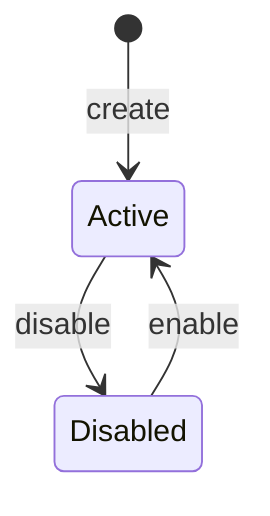
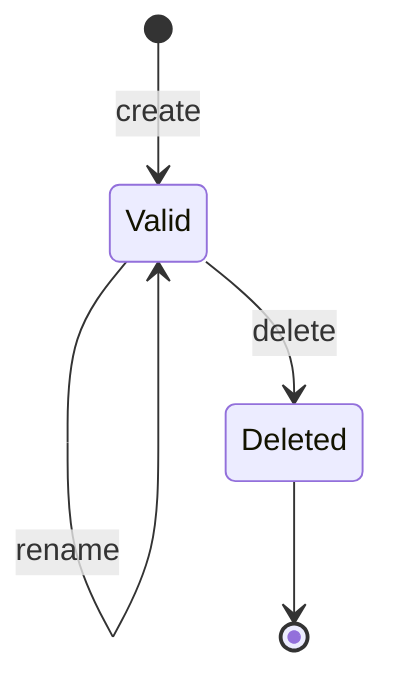

# 202608-01 多租户

## 概述

本 Feature 让单次部署的 Stargate Next 可同时服务多个相互独立的业务应用。每个应用对应一个 Tenant；Tenant 内的 Account、Session、Captcha、登录限流、创建幂等与认证审计彼此隔离，互不可见。

`Tenant`、`tenantId`、`tid` 表示认证数据隔离边界，不等于旧 Auth Namespace，也不等于 Mekong Organization。

范围：

- 引入 Tenant 实体，持久化于 PostgreSQL；内置默认租户的 ID 与名称均为 `default`（migration/seed 保证存在，不可删除、不可改 ID）。
- 通过 Admin API 创建、停用与分页查询 Tenant；创建时可省略 `id`（服务端生成）或由 Admin 指定（支持用 k8s namespace 命名）；创建 Tenant **不**创建 Tenant API Key。Tenant API Key 作为独立数据库实体（仅存 hash），须单独创建，并支持分页查询、仅改名与删除。
- 请求解析 Tenant：显式指定时进入对应租户；未指定时落入 `default`，兼容现有调用方式。
- 登录标识唯一性、Session、Captcha、登录失败计数/锁定、Account 创建幂等均按 Tenant 作用域生效。
- 管理类 API（账户、会话）不得跨 Tenant 读写（Admin 代操作时仍必须落入明确的单一租户上下文）。
- Access Token 携带 `tid`；`default` 场景下为 `tid=default`。

本期不实现 Tenant 公开自助注册门户、按 Tenant 独立数据库/独立部署、按 Tenant 独立 JWT 签名密钥，也不把 Tenant 建模为业务组织或授权对象。

## 领域模型变更

### 统一语言

| 术语 | 定义 | 不表示 |
| --- | --- | --- |
| Tenant（租户） | Stargate Next 认证数据的逻辑隔离边界。 | 不等于旧 Auth Namespace、Mekong Organization、Role 或 Permission。 |
| Tenant ID / `tenantId` | Tenant 的稳定主键；也是请求 `x-tenant-id` 与 Access Token `tid` 的取值。预期与部署侧 K8s namespace 对齐。 | 不由 Tenant 名称推导；不是独立于 `id` 的 slug 字段。 |
| Tenant Status | Tenant 是否允许进入认证数据面的状态：`active` 或 `disabled`。 | 不表示 Tenant 已被物理删除。 |
| Tenant API Key | 固定归属一个 Tenant 的服务凭证，可管理该 Tenant 的账户、会话与 API Key。 | 不映射为人员 Account、Session 或业务权限。 |
| Tenant API Key Digest | 使用专用 HMAC key 计算的 Tenant API Key 摘要，由 `hmacKeyId` 与 `hash` 组成。 | 不可还原为 API Key 明文。 |
| Admin API Key | 平台信任根，用于管理 Tenant（含可选指定 `id`、分页列表）与 Tenant API Key（含分页列表）。 | 不是任何 Tenant 的业务凭证；代操作业务资源时仍必须解析到单一 Tenant。 |
| Tenant Principal | Access Token 校验后的 `{ accountId, sessionId, tenantId }`。 | 不包含 Profile、Organization、Role 或 Permission。 |

### 标识与值对象

- `TenantId` 创建后不可修改；默认 Tenant 固定使用字面量 `default`。
- **API 校验（严）**：除保留字 `default` 外，`TenantId` 必须符合 K8s namespace / DNS label：`[a-z0-9]([-a-z0-9]*[a-z0-9])?`，最长 **63**。
- **DB 存储（宽）**：`id` 列使用 `VARCHAR(200)`，物理上限宽于 API，便于演进；写入前仍须通过 API 校验。
- 创建时：不传 `id` → 服务端生成满足上述 API 约束的稳定 ID（如 CUID）；传 `id` → **仅** `STARGATE_ADMIN_API_KEY` 可指定，用于与 K8s namespace 对齐；冲突返回 `TENANT_ALREADY_EXISTS`。
- `TenantName` 仅为展示文本，不参与路由、不要求唯一，也不得用于认证。
- `TenantApiKeyDigest = { hmacKeyId, hash }`，其中 `hash = HMAC-SHA256(secret, fullTenantApiKey)`；`(hmacKeyId, hash)` 在全部 Tenant API Key 中唯一。
- `firstFour` 是 API Key 随机主体的展示元数据，不是认证材料。

### 实体、聚合与关系

Tenant 是 Tenant 生命周期的聚合根；Tenant API Key 是独立管理的凭证实体，通过 `tenantId` 引用 Tenant。Tenant 停用不删除其 Key 或认证历史，但会阻止其被使用。

| 实体 / 支持模型 | 多租户变更 |
| --- | --- |
| Tenant | 新增 `id`、`name`、`status`、`createdAt`、`updatedAt`。 |
| Tenant API Key | 新增 `id`、`tenantId`、`name`、`firstFour`、`hmacKeyId`、`hash`、`createdAt`、`updatedAt`。 |
| Account | 新增 `tenantId`；登录标识唯一性由全局改为 Tenant 内唯一。 |
| Session | 新增 `tenantId`；必须与关联 Account 的 `tenantId` 相同。 |
| CaptchaChallenge、Login Lock、Idempotency Key | Redis key 必须带 `tenantId`，同一短期状态不得跨 Tenant 命中。 |
| AuthAuditEvent | 新增 `tenantId`，用于保留隔离后的认证安全事实。 |

### Tenant

Tenant 是认证数据的隔离边界，不是业务组织：

- `id` 为稳定主键，即 API 和领域模型中的 `tenantId`、JWT 的 `tid` 与 `x-tenant-id` 的取值；创建后不可修改。预期与 k8s namespace 同名对齐（尤其是测试/CI 环境）。
- `name` 为仅用于展示和描述的可选文本；不参与请求路由、不要求全局唯一、不是独立 slug。
- 状态：`active` | `disabled`。`disabled` 后拒绝该租户下的管理 API、登录与 Refresh；已签发 Access Token 仍按现有规则可用至自身过期。
- `default`：服务启动/迁移后始终存在且为 `active`；`id` 与 `name` 均为字面量 `default`；不可删除、不可改 ID；不可被再次创建占用；可被 Admin 停用（运维需谨慎，停用后等同关闭默认租户认证面）。
- 非默认 Tenant 由 Admin API 创建：可只提交 `name`（服务生成 `id`），或同时提交符合 API 约束的 `id` 与可选 `name`；`id` 已存在时返回 `TENANT_ALREADY_EXISTS`（便于 CI/CD 幂等）；**创建 Tenant 不附带 Tenant API Key**，Key 须另一步创建；停用为状态变更，不物理删除行，以免 Account/审计历史悬空。
- Admin 可分页列出 Tenant，并按 `name` **精确匹配**过滤（`name` 仍不唯一；列表用于运维与测试环境探测，不以 `name` 作为认证或路由键）。
- Tenant 不进入 Mekong 授权模型；与 Organization、Role、Permission 无关。**Tenant ≠ 旧 Auth Namespace ≠ Organization**；`tenantId` 可与 K8s namespace 对齐，但不因此成为业务组织模型。

## 请求归属与认证策略

每个进入认证域的请求都必须解析到唯一 Tenant：

1. 若请求携带 `x-tenant-id`，则按 Tenant `id` 精确查找。
2. 若未携带该头，则归属 `default`。
3. 若 `tenantId` 未知或对应 Tenant 为 `disabled`，不进入该租户数据面，返回稳定错误（管理面可用 `TENANT_INVALID` / `TENANT_DISABLED`；公开登录相关接口对外可不暴露租户枚举细节）。

`name` 不得作为 `x-tenant-id` 的输入。现有未传 `x-tenant-id` 的调用方继续落在 ID 为 `default` 的 Tenant，路径与请求体形状保持兼容。

### API Key 身份主体与授权

管理类接口仍通过 `x-api-key` 鉴权。凭证分三类，职责分离：

| 凭证 | 来源 | 权限 |
| --- | --- | --- |
| `STARGATE_API_KEY` | 环境/Secret（配置） | 仅绑定 `default` 租户，兼容现网；**不是**平台最高权限。 |
| Tenant API Key | PostgreSQL（只存 hash） | 固定在所属 Tenant；可管理该租户账户/会话及同租户的 API Key（含分页列表）。 |
| `STARGATE_ADMIN_API_KEY` | 环境/Secret（配置） | 平台信任根：创建/停用/分页查询 Tenant（创建时可指定 `id`）、创建/分页查询/编辑/删除 Tenant API Key；代操作账户/会话等业务资源时须通过 `x-tenant-id`（缺省为 `default`）落入单一租户上下文。 |

解析规则：

1. 命中 Tenant API Key → 租户上下文固定为该 Key 所属 Tenant；携带其他 `x-tenant-id` 时拒绝。
2. 命中 `STARGATE_API_KEY` → 行为同 `default` 的 Tenant API Key。
3. 命中 `STARGATE_ADMIN_API_KEY` → 按 `x-tenant-id`（缺省 `default`）选择目标租户；代操作账户/会话等业务资源时不得无租户上下文扫全库。Tenant 控制面（创建、停用、分页列表）属平台级操作，不依赖业务租户上下文。
4. 未携带或错误的 API Key 行为与现网一致（`API_KEY_INVALID`）。

登录、Captcha、Refresh、Logout 等公开认证接口不依赖 API Key；其 Tenant 由 `x-tenant-id`（缺省 `default`）决定。

### Tenant 管理（Admin）

仅 `STARGATE_ADMIN_API_KEY` 可调用：

- **创建** `POST`：请求体可含可选 `id`、可选 `name`。
  - 不传 `id`：服务端生成满足 API 约束的 ID。
  - 传 `id`：须通过 API 校验（支持`a-zA-Z0-9`和`-`、长度≤63、非保留 `default`）；已存在则 `TENANT_ALREADY_EXISTS`。
  - Tenant API Key / `STARGATE_API_KEY` 若提交 `id` 字段，一律拒绝。
- **停用 / 启用**：按 `tenantId` 变更状态，不物理删除。
- **分页列表** `GET`：支持分页参数。

列表与按 `id` 的存在性冲突响应均不得返回 Tenant API Key 明文或 hash。

### Tenant API Key 管理

Tenant API Key 是独立的 PostgreSQL 实体，字段包括：

- `id`：系统生成的稳定 Key ID。
- `tenantId`：所属 Tenant ID；创建后不可修改。
- `name`：调用方可读的描述名称；编辑时**仅允许修改此字段**，不参与认证或路由。
- `firstFour`：API Key 随机主体的前 4 个字符，仅用于列表展示与人工辨认；不参与认证。
- `hmacKeyId`、`hash`：使用指定 HMAC key 计算的 API Key 摘要；创建响应后不再返回明文。
- `createdAt`、`updatedAt`：生命周期审计时间。

规则：

- **摘要算法与轮换**：复用 Refresh Key 的摘要模式：`hash = HMAC-SHA256(secret, fullTenantApiKey)`，并记录生成该摘要的 `hmacKeyId`。`firstFour` 从 API Key 随机主体提取，但不参与摘要或认证。新 Key 使用 primary HMAC key；校验时分别以 primary 和可选 secondary HMAC key 计算候选 `(hmacKeyId, hash)` 后精确查询。`(hmacKeyId, hash)` 在全部 Tenant API Key 中唯一，使 HMAC secret 可以无停机轮换。
- **密钥隔离**：Tenant API Key 使用专用的 `TENANT_API_KEY_HMAC_*` primary/secondary 配置；不得复用 Refresh Key、Captcha 或 JWT 的 HMAC/signing secret。
- **创建**：Tenant API Key **仅**通过独立的 Key 管理接口创建，不与创建 Tenant 绑定。Admin 可为任意已有 Tenant 创建 Key；该 Tenant 的有效 Key 也可为同租户创建新 Key。创建响应中的明文 Key **仅出现一次**，服务端不使用可逆加密存储明文。无 Key 的 Tenant 仍可由 Admin 凭 `STARGATE_ADMIN_API_KEY` + `x-tenant-id` 代操作。
- **分页列表**：在单一 Tenant 上下文内分页列出该租户的 API Key。Admin 通过 `x-tenant-id`（缺省 `default`）指定目标租户；Tenant API Key / `STARGATE_API_KEY` 仅可列出自身所属租户的 Key。列表项含 `id`、`tenantId`、`name`、`firstFour`、`createdAt`、`updatedAt` 等元数据，**不得**返回明文 Key、`hash` 或 HMAC secret；可用 `firstFour` 做人工辨认。
- **并存与迁移**：创建新 Key 不影响任何已存在 Key；新旧 Key 可并行使用，便于调用方完成迁移。
- **编辑**：仅 Admin 或同 Tenant 的有效 Key 可以编辑该 Tenant 的 Key；请求体只允许变更 `name`，不得变更 `id`、`tenantId`、`firstFour`、`hmacKeyId` 或 `hash`。
- **删除**：Admin 可删除任意 Tenant API Key；同 Tenant 的 Key 可删除该 Tenant 的其他 Key，但**不得删除当前用于认证该请求的同一把 Key**。删除成功后目标 Key 立即失效；其他未删除 Key 不受影响。
- **校验**：请求 Key 按 primary 和可选 secondary HMAC key 计算候选摘要，按 `(hmacKeyId, hash)` 查询，并对结果执行常量时间比较；所属 Tenant 必须为 `active`。
- Admin Key 与 `STARGATE_API_KEY` 不入库；丢失时通过更新部署 Secret 恢复。

`default` 引导：migration/seed 创建 `default` 行；现网 `STARGATE_API_KEY` 继续作为该租户的兼容调用凭证。可为 `default` 额外创建数据库 Tenant API Key，但不削弱 `STARGATE_API_KEY` 的兼容语义。

## 生命周期与状态转换

### Tenant 生命周期

- 新建的非默认 Tenant 进入 `active`；默认 Tenant 由 migration/seed 建立为 `active`。
- `disabled` Tenant 的管理 API、登录和 Refresh 均被拒绝；已签发的 Access Token 仍可使用至自身 `exp`。
- Tenant 不物理删除；`default` 不可删除或改 ID。

### Tenant API Key 生命周期

- 创建新 Key 不改变任何已存在 Key 的状态；多个 Valid Key 可并存。
- 仅 `name` 可被编辑，Key 明文只在创建响应中出现一次。
- 删除目标 Key 后立即失效；使用某 Tenant API Key 发起的请求不得删除该 Key 自身。
- Tenant 被 `disabled` 时，其 Valid Key 不可用于认证；重新启用后未删除 Key 可再次使用。

## 审计

Tenant 相关安全操作写入不可变 AuthAuditEvent，并携带目标 `tenantId`、`actorType`、可选 `actorId` 与 Request Context。至少记录：

- `tenant.created`。
- `tenant.enabled`、`tenant.disabled`。
- `tenant_api_key.created`、`tenant_api_key.deleted`。

Tenant 名称和 Tenant API Key 名称仅为展示元数据；`tenant.name_updated` 与 `tenant_api_key.name_updated` **不写入审计**。Tenant API Key 的审计 metadata 可包含目标 `apiKeyId`、`name` 与 `firstFour`，但不得包含 API Key 明文、`hash`、HMAC secret 或完整 `x-api-key`。

## 关键业务不变量

### 数据隔离

在同一 Tenant 内：

- username、登录 phone、登录 email 规范化后分别唯一（规则同 [202607-02](./202607-02-account-management.md)）。
- Account、Session、Captcha、Login Lock、Idempotency Key、Auth Audit Event 均带 `tenantId` 并按其过滤。

跨 Tenant：

- 相同 username/phone/email 可在不同 Tenant 各自存在，互不影响。
- 不得通过 Account ID、Session ID、Captcha ID、Refresh Key 或 Access Token 读取或操作另一 Tenant 的数据。
- Refresh Key 校验必须同时匹配所属 Tenant；不得仅凭全局 hash 命中。

Account ID、Session ID 仍为全局唯一稳定标识（CUID）。查询与鉴权必须以「先解析 Tenant 再按 ID 查找且校验归属」完成，禁止只按全局 ID 跨租户命中。

### Token 与 Principal

在既有最小 claims 上增加 `tid`：

- `sub`、`sid`、`type`、`iat`、`exp`、`tid`。
- `tid` 严格等于签发时 Account 所属 Tenant 的 `id`。
- 默认 Tenant 签发的 Token 显式携带 `tid=default`。
- 校验成功后 Principal 为 `{ accountId, sessionId, tenantId }`。
- 资源方若忽略 `tid`，行为与现网按 `accountId` 关联业务数据一致；多应用集成应校验 `tid`。

本期仍不把组织、角色、权限写入 JWT。仍不逐请求校验 Session；撤销与禁用规则同 [202607-03](./202607-03-auth-session.md)。

## 配置、持久化与兼容

**PostgreSQL 持有**：Tenant 行与状态（`id` 列 `VARCHAR(200)`）、Tenant API Key 的 `id`、`tenantId`、`name`、`firstFour`、`hmacKeyId`、`hash` 及生命周期元数据、带 `tenantId` 的认证业务数据。

**配置 / Secret 持有**：`STARGATE_ADMIN_API_KEY`、`STARGATE_API_KEY`、JWT/HMAC 等现有密钥。

### 明确非目标

- 不按 Tenant 拆分 PostgreSQL schema 或物理库（逻辑隔离即可）。
- 不提供终端用户跨 Tenant 单点登录或 Tenant 切换。
- 不在 JWT 中加入业务授权 claims。
- 不把旧 Auth Namespace 映射为 Tenant。
- 不提供公开自助「注册新租户」门户（仅 Admin 控制面创建）。
- 不对 Tenant API Key 做可逆加密存库或二次展示同一明文。
- 不引入独立于 `id` 的 Tenant slug 字段，也不按 Tenant `name` 解析 `x-tenant-id`；Admin 指定的 `id` 本身即主键（可与 k8s namespace 对齐）。
- 不以 `name` 唯一约束保证幂等；需要确定性幂等时由 Admin 指定 `id`。

## 验收

### 默认租户兼容现有调用

**Given**

- 服务已配置 `STARGATE_API_KEY`；库中存在 `id=default`、`name=default` 的 Tenant。
- 调用方使用现有 SDK/HTTP 调用方式，不传 `x-tenant-id`。

**When**

- 完成 Captcha → 创建 Account → 登录 → Refresh → 查询/撤销 Session → 退出的既有流程。

**Then**

- 全部数据写入 `default` 租户。
- 请求路径、请求体字段与错误码与多租户引入前保持兼容。
- 签发的 Access Token 含 `tid=default`，其余 claims 语义不变。
- 使用 `STARGATE_API_KEY` 即可管理 `default` 数据，无需新头。

**验证**

- 既有 API/SDK 黑盒测试在默认配置下全部通过。
- 契约测试断言 Access Token 含 `tid`。

### Admin 创建与停用 Tenant

**Given**

- 调用方持有有效 `STARGATE_ADMIN_API_KEY`。

**When**

- 不传 `id`，创建名称为“应用 A”的 Tenant；再单独为其创建一把 Tenant API Key；随后将该 Tenant 设为 `disabled`。
- 另一次创建传入 `id` 为合法 K8s namespace 形态（如 `app-a`）及可选 `name`；再次用同一 `id` 创建。

**Then**

- 创建 Tenant 的响应仅含 Tenant 元数据，**不含** API Key；未传 `id` 时返回服务端生成且满足 API 约束的 `tenantId`。
- 传入 `id` 时，创建成功后 `tenantId` 等于请求值；再次创建同一 `id` 返回 `TENANT_ALREADY_EXISTS`，不新建行。
- 传入非法 `id`（超过 63、含大写/非法字符、或 `default`）被 API 拒绝；DB 列宽为 200 不意味着 API 放宽。
- `name` 仅为描述，不要求唯一；后续修改名称不改变 `tenantId`，也不影响以该 ID 传入 `x-tenant-id` 的请求。
- 随后单独创建的 Tenant API Key 明文仅出现一次；可在 `active` 期间管理该 Tenant 的资源。
- 停用后：该 Tenant Key 与该租户下的登录、Refresh、账户管理均失败；不物理删除 Tenant 行与既有 Account 行。
- 使用 Tenant Key 或非 Admin 凭证无法创建/停用 Tenant，也无法指定 `id`。

**验证**

- Tenant 管理 API 黑盒测试；审计记录创建与停用事件（不含 Key 明文或 hash）。

### Admin 分页查询 Tenant

**Given**

- 调用方持有有效 `STARGATE_ADMIN_API_KEY`；库中存在多个 Tenant。

**When**

- 分页列出全部 Tenant。

**Then**

- 返回分页结果，含 `id`、`name`、`status` 等元数据，不含任何 API Key 明文或 hash。
- 非 Admin 凭证不可调用列表接口。

**验证**

- Tenant 列表 API 黑盒测试。

### 显式租户隔离账户与登录标识

**Given**

- 存在 `active` 的 `default` 与一个 ID 为 `{appATenantId}` 的 Tenant，且各有可用管理凭证。
- `default` 中已存在 username 为 `alice` 的 Account。

**When**

- 使用 `{appATenantId}` 的 Tenant API Key 创建 username 同为 `alice` 的 Account。
- 随后分别在两个 Tenant 下使用 `alice` 登录。

**Then**

- `{appATenantId}` 中的创建成功，不与 `default` 冲突。
- 两个 Tenant 各自登录成功，得到不同的 Account ID 与 Session。
- 在错误 Tenant 上下文中按另一 Tenant 的 Account ID 查询或变更时返回 `ACCOUNT_NOT_FOUND`（或不暴露跨租户存在性的等价语义）。

**验证**

- `POST /v1/accounts`、`GET /v1/accounts/{accountId}`、`POST /v1/auth/login`。
- API 黑盒测试覆盖跨租户同名标识与按 ID 跨租户拒绝。

### API Key 不得越权切换租户

**Given**

- ID 分别为 `{appATenantId}` 与 `{appBTenantId}` 的 Tenant 各有独立 Tenant API Key。

**When**

- 使用 `{appATenantId}` 的 Key 同时携带 `x-tenant-id: {appBTenantId}` 调用管理 API；或使用前者的 Key 操作属于后者的 Account ID。
- 使用 `STARGATE_API_KEY` 尝试操作 `{appATenantId}` 资源。

**Then**

- Tenant Key 与 `x-tenant-id` 不一致时被拒绝。
- 无法读到或修改其他租户数据。
- `STARGATE_API_KEY` 不能管理非 `default` 租户。

**验证**

- 账户与会话管理相关黑盒测试。

### Admin 代操作必须带租户上下文

**Given**

- 调用方持有 `STARGATE_ADMIN_API_KEY`，且 ID 为 `{appATenantId}` 的 Tenant 为 `active`。

**When**

- 携带 Admin Key 与 `x-tenant-id: {appATenantId}` 创建 Account；不携带 `x-tenant-id` 时创建 Account。

**Then**

- 前者写入 `{appATenantId}`。
- 后者写入 `default`（与缺省归属规则一致），不得隐式跨租户批量操作。

**验证**

- Admin + 账户管理黑盒测试。

### Tenant API Key 创建、编辑、分页查询与删除

**Given**

- ID 为 `{appATenantId}` 的 Tenant 持有一把有效 Tenant API Key `keyA`。

**When**

- 使用 `keyA` 创建另一把名为“迁移用”的 Key `keyB`，随后将 `keyB` 的名称改为“生产调用”。
- 分别使用 `keyA`、`keyB` 调用管理 API；分页列出 `{appATenantId}` 下的 API Key。
- 使用 `keyA` 删除 `keyB`；再使用 `keyA` 尝试删除自身。
- 使用 Admin Key 携带 `x-tenant-id: {appATenantId}` 分页列出该租户 API Key；使用 `{appATenantId}` 的 Key 尝试列出其他租户的 Key。

**Then**

- 创建 `keyB` 后，`keyA` 与 `keyB` 均可用；新 Key 的明文仅出现一次。
- 分页列表返回该租户下的 Key 元数据（含 `id`、`name`、`firstFour`、时间戳等），不含明文、`hash` 或 HMAC secret；`firstFour` 可供人工辨认。
- Admin 与同租户 Key 均可列出该租户 Key；跨租户列举被拒绝或无法看到其他租户数据。
- 编辑仅更新 `keyB.name`，不得修改其 `id`、`tenantId`、`hmacKeyId` 或 `hash`。
- 删除 `keyB` 后，`keyB` 立即失效，`keyA` 继续有效。
- 使用 `keyA` 删除自身被拒绝；Admin 仍可删除任意 Tenant API Key。
- 库中始终无明文 Key；仅保留 `hmacKeyId` 与 HMAC-SHA256 `hash`。

**验证**

- Key 创建、编辑、分页列表、并存、删除与禁止自删的黑盒测试。

### Captcha、限流与幂等按租户隔离

**Given**

- 两个 `active` Tenant 均可创建 Captcha 与 Account。

**When**

- 在 Tenant A 创建 Captcha，于 Tenant B 的登录请求中提交该 Captcha ID 与正确验证码。
- 在 Tenant A 触发针对某 login 的失败锁定后，于 Tenant B 使用相同 login 字符串尝试登录。
- 在两个 Tenant 使用相同 Idempotency Key 各创建一次 Account。

**Then**

- 跨 Tenant 复用 Captcha 失败。
- Tenant A 的登录锁不影响 Tenant B。
- 相同 Idempotency Key 在不同 Tenant 下各自独立生效，可创建两个 Account。

**验证**

- Captcha、login、账户创建幂等相关黑盒测试。

### Refresh 与 Token 不跨租户生效

**Given**

- ID 为 `{appATenantId}` 的 Tenant 中一个 Account 已登录，持有 Access Token 与 Refresh Key。

**When**

- 在 ID 为 `{appBTenantId}` 的 Tenant 上下文尝试 Refresh。
- 校验 Access Token 并读取 `tid`。

**Then**

- Refresh 失败；原 Session 在 `{appATenantId}` 中仍可按正确 Tenant 刷新（若尚未退出/撤销）。
- Access Token 的 `tid` 为 `{appATenantId}`；Principal 含对应 `tenantId`。

**验证**

- `POST /v1/auth/refresh` 与 Token 校验相关测试。

### 未知或停用租户被拒绝

**Given**

- 库中仅有 `default` 与 ID 为 `{appATenantId}` 的 Tenant；后者可被设为 `disabled`。

**When**

- 请求携带一个不存在的合法形态 Tenant ID；或携带已停用的 `{appATenantId}`。

**Then**

- 管理 API 与公开认证 API 均不进入该租户数据面，返回稳定错误，且不创建 Account/Session/Captcha。

**验证**

- API 黑盒测试覆盖未知与停用租户。
